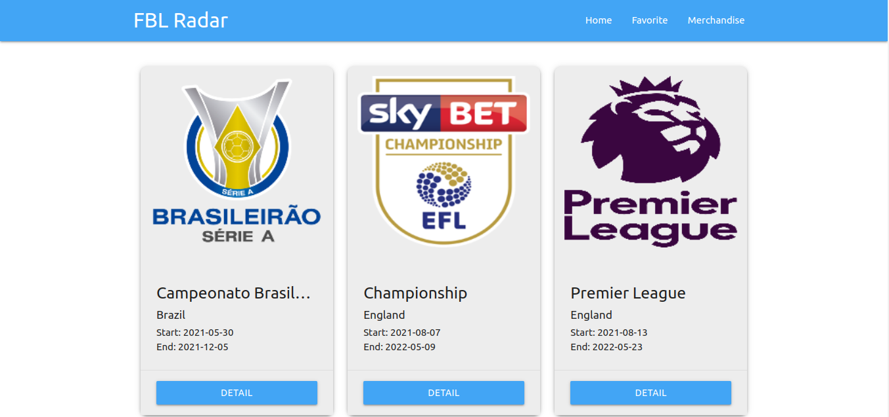

# Football Radar



[View project](https://footballradar.netlify.app/)

A Progressive Web Application that shows football informations. The UI is built using Materialize CSS. As a PWA, it is capable of working in offline mode by using previously stored cache. Another notable feature is ability to store data in IndexedDB storage, as seen with the favorite team feature. It is also able to send push message from the server via Firebase Cloud Messaging integration.

## Getting Started
1. Clone this repository  
```
git clone https://github.com/rizkyzhang/football-radar.git
```
2. Install all dependencies
```
nmp i
```
3. Run the project
```
npx snowpack dev
```
## Techs
- HTML 
- CSS 
- Materialize CSS 
- JavaScript
- Snowpack
- IndexedDB 
- Service Worker 
- Workbox 
- Firebase Cloud Messaging
- [Football API](https://www.football-data.org/)
